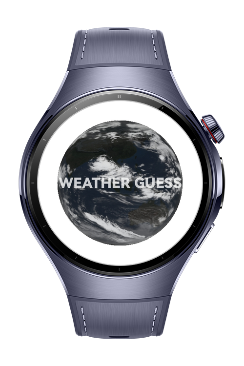
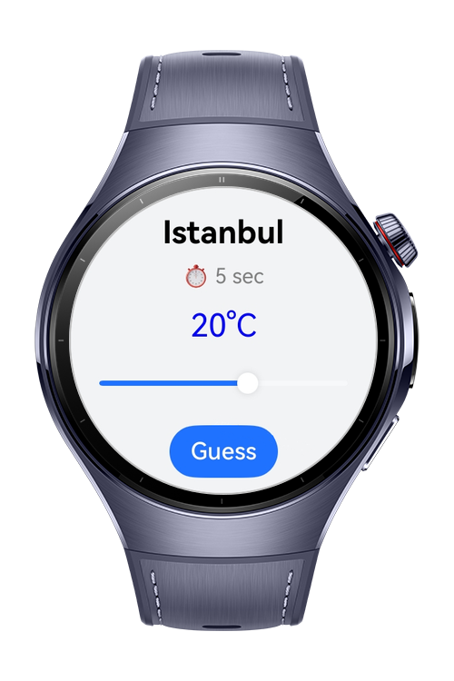
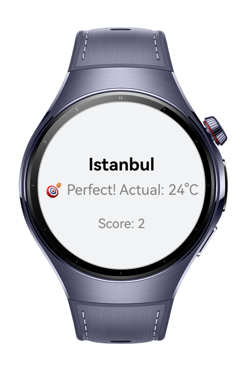
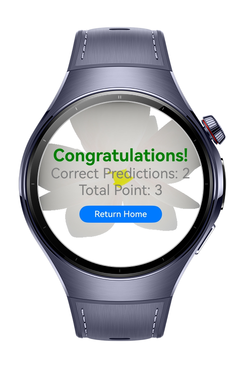

> **Note:** To access all shared projects, get information about environment setup, and view other guides, please visit [Explore-In-HMOS-Wearable Index](https://github.com/Explore-In-HMOS-Wearable/hmos-index).

# Weather Guess

WeatherGuess is a fun temperature prediction game for HarmonyOS devices. Powered by ArkGraphics 3D and Sensor Kit, it starts with a simple wrist shake and challenges you with random city temperatures. Your final score appears on a clean results page, making weather guessing playful and engaging.

# Preview

<div>
	
	
	
	
</div>

# Use Cases

- Start with Wrist Shake: Begin the game by shaking your wrist using Sensor Kit.
- Random Temperature Guess: Predict the temperature of a randomly selected city.
- 3D Visual Experience: ArkGraphics 3D models enhance the UI during gameplay.
- Score and Results Page: View total points and accuracy on the final results screen.
- Replay Challenge: Instantly restart with new random cities.

# Technology

## Stack

- Languages: ArkTS (Ark TypeScript)
- Frameworks: HarmonyOS SDK 5.1.0 (API Version 18)
- Tools: DevEco Studio Version 5.1.0.842
- Libraries & Kits:
 	- @kit.ArkGraphics3D Used for rendering 3D models and enhancing the game’s visual experience.
	- @kit.SensorKit Detects wrist shake gestures to start the game.
	- @kit.PerformanceAnalysisKit Provides logging and debugging support via hilog.
	- @kit.ArkUI Delivers interactive UI components and smooth user experience.

## Required Permissions
- ohos.permission.ACCELEROMETER
- ohos.permission.GYROSCOPE
 
# Directory Structure

```
|---constants
|   |---Constants.ets           # Application constants and config values

|---model
|   |---CityModel.ets           # Represents city data for random selection

|---pages
|   |---GameScreen.ets          # Main gameplay screen with 3D UI and temperature guessing
|   |---HomeScreen.ets          # Entry screen with game intro and start option
|   |---Index.ets               # Entry point for routing and initialization

|---utils
|   |---Logger.ets              # Logging and debugging helper
```

# Constraints and Restrictions

## Supported Devices

- Huawei Watch 5
- Devices running HarmonyOS 5.1.0 (API 18) and above


# Licence

WeatherGuess is distributed under the terms of the MIT License
See the [LICENSE](./LICENSE) for more information.


